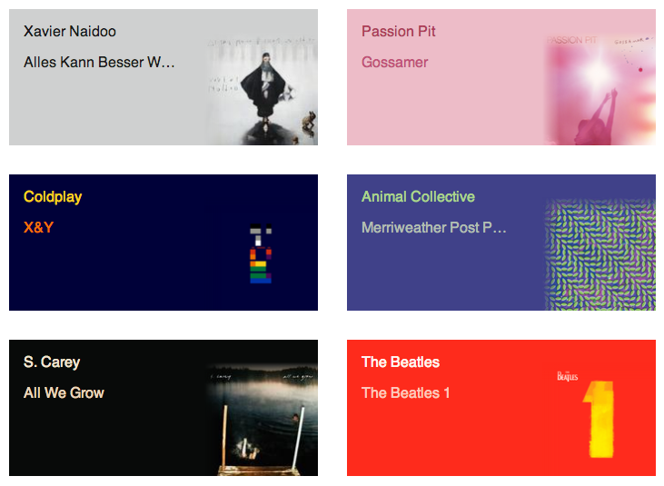

# AlbumColors.js

A script to pick 3 colors from an image to create a pallete for
background and text colors. Inspired by iTunes 11.

## Examples

[Hosted example] (http://albumcolors.chengyinliu.com/examples/lastfm?lastfm=willowm)
showing album info generated from users' last.fm. Try it with your own
username for different results.

## How to Use
	var url = 'http://www.google.com/images/srpr/logo3w.png',
		albumColors = new AlbumColors(url);

	albumColors.getColors(function(colors) {
		console.log(colors);
		// Result: [[254, 254, 254], [2, 138, 14], [4, 171, 21]]
	});
	
## License
	[University of Illinois/NCSA] (http://opensource.org/licenses/NCSA)
